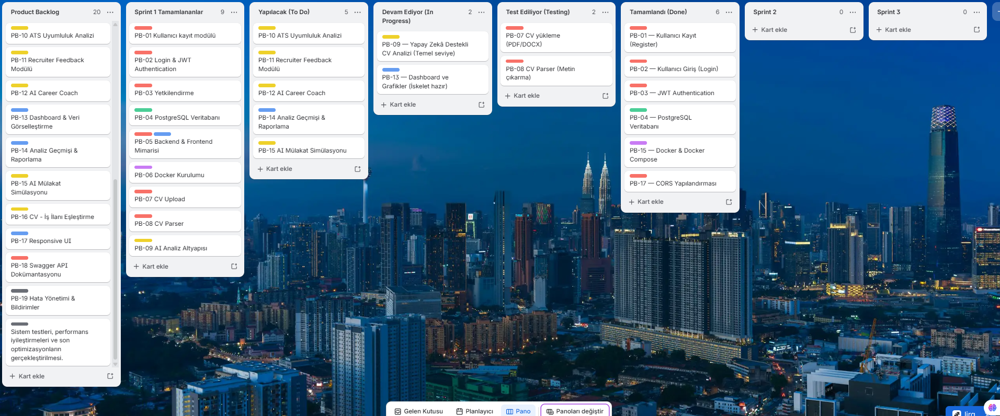
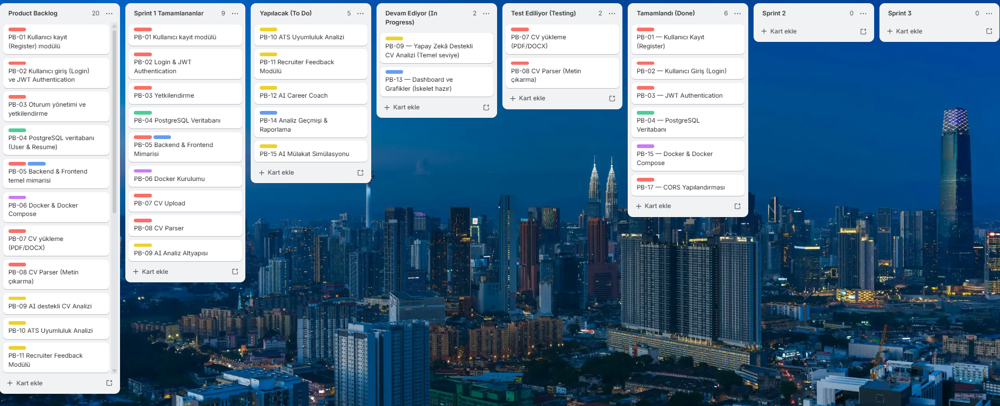
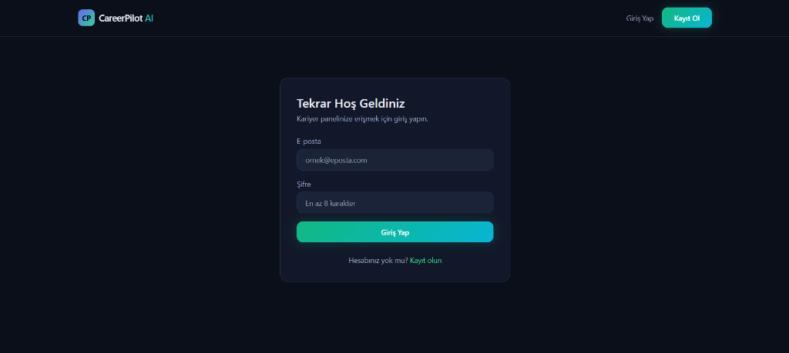
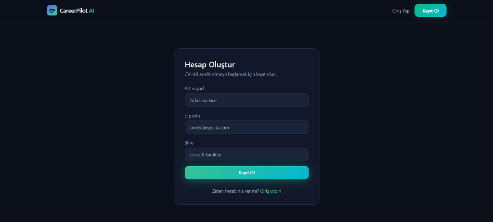
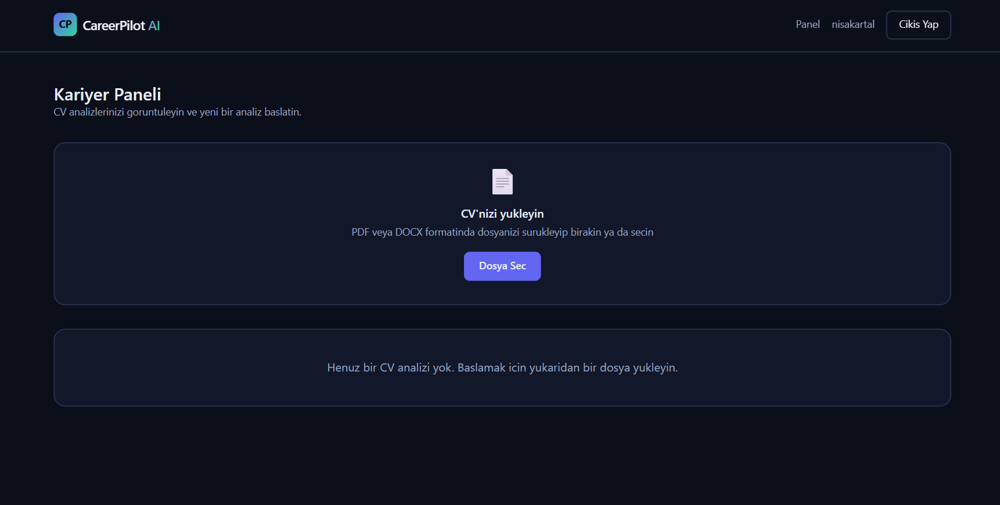
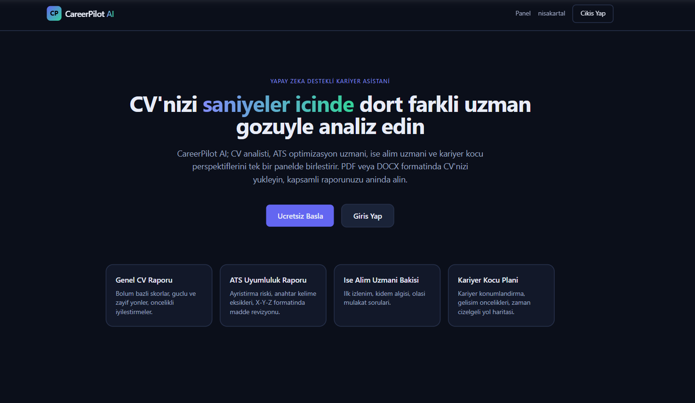

# CareerPilot - Grup 79

## Yapay Zekâ Destekli Kariyer ve CV Asistanı

CareerPilot AI; kullanıcıların özgeçmişlerini derinlemesine analiz eden, ATS (Applicant Tracking System) uyumluluğunu ölçümleyen, güncel iş ilanlarıyla akıllı semantik eşleştirmeler yapan ve kariyer gelişimlerine yönelik kişiselleştirilmiş yol haritaları sunan **uçtan uca bir dijital kariyer asistanı platformudur.**

Platform, adayların işe alım süreçlerinde daha rekabetçi ve başarılı olabilmeleri adına; CV optimizasyonu, yapay zekâ tabanlı mülakat simülasyonları ve dinamik kariyer planlaması araçları sunar.

---

## Takım Bilgileri: CareerPilot Team - Grup 79

Ekibimiz Yapay Zeka ve Teknoloji Akademisi bünyesinde çapraz fonksiyonlu (Cross-Functional) olarak çalışmaktadır. Akademi kuralları gereği ekibimizde tek bir lider bulunmamakta; tüm üyeler eşit sorumlulukla hem süreç yönetiminde hem de ürünün geliştirilmesinde aktif rol oynamaktadır.

| Role | Team Member |
|------|-------------|
| **Scrum Master (Communication Lead)** | **Hayrunnisa Kartal**<br>Scrum Master & AI/Backend Developer |
| **Product Owner (Deputy Communication Lead)** | **Utku Akkuşoğlu**<br>Product Owner & Full Stack Developer |
| **Developer** | **Yiğit Emir Saatçi**<br>Full Stack Developer & AI Developer |

--- 

## Problem ve Çözüm

### Problem Tanımı
*   **ATS Engeli:** İş ve staj başvurusu yapan birçok nitelikli aday, hazırladıkları CV'lerin ATS (Aday Takip Sistemleri) standartlarına ve algoritmalarına uygun olmaması nedeniyle ilk aşamada elenmektedir.
*   **Bütünleşik Platform Eksikliği:** Adayların kariyer gelişimlerini merkezi bir sistemden takip edebilecekleri, teknik/sosyal eksik yetkinliklerini analiz edebilecekleri ve doğrudan aksiyona dönüştürülebilir kişiselleştirilmiş geri bildirim alabilecekleri bütünleşik bir çözüm bulunmamaktadır.

### Çözümümüz
CareerPilot AI, yapay zekanın gücünü kullanarak aday ile iş dünyası arasındaki bu köprüyü kurar:
*   **Detaylı CV Analizi:** Güçlü yönleri ve eksikleri anında listeler, puanlama sunar.
*   **ATS Uyumluluk Ölçümü:** CV'nin kurumsal sistemlerden geçme şansını anahtar kelimeler üzerinden hesaplar.
*   **Akıllı İlan Eşleştirme:** CV ile hedeflenen ilan arasındaki semantik uyum yüzdesini çıkarır.
*   **Mülakat ve Recruiter Simülasyonu:** Gerçekçi İK geri bildirimleri ve teknik sorularla adayı mülakata hazırlar.
*   **Kariyer Yol Haritası:** Eksik yetkinlikler için sertifika, teknoloji ve eğitim önerileri sunar.

---
##  Hedef Kitle
*  Üniversite öğrencileri ve yeni mezunlar
*  Aktif olarak staj ve iş arayan adaylar
*  Sektör veya kariyer yolu değiştirmek isteyen profesyoneller

---
##  Kullanılan Teknolojiler & Mimari Yapı

# Kullanılan Teknolojiler

| Katman | Teknoloji |
|---------|-----------|
| Backend | FastAPI |
| ORM | SQLModel |
| Database | PostgreSQL |
| Frontend | Next.js |
| UI | Tailwind CSS |
| Grafik | Recharts |
| AI | OpenAI GPT-4o |
| Prompt | LangChain |
| Container | Docker |
| API Docs | Swagger |

---

# Sistem Mimarisi

```text
                +----------------------+
                |     Next.js UI       |
                +----------+-----------+
                           |
                        REST API
                           |
                +----------v-----------+
                |      FastAPI         |
                +----------+-----------+
                           |
        +------------------+-------------------+
        |                  |                   |
 Resume Service      Auth Service        AI Service
        |                  |                   |
        |                  |             OpenAI API
        |                  |
        +------------------+
               |
         PostgreSQL
```

---

# Proje Yapısı

```text
careerpilot-ai/
├── docker-compose.yml
├── README.md
├── assets/
├── backend/
│   ├── Dockerfile
│   ├── requirements.txt
│   ├── .env.example
│   └── app/
│       ├── main.py
│       ├── core/
│       │   ├── config.py
│       │   ├── database.py
│       │   └── security.py
│       ├── api/
│       │   ├── deps.py
│       │   └── endpoints/
│       │       ├── auth.py
│       │       └── resume.py
│       ├── models/
│       │   ├── user.py
│       │   └── resume.py
│       ├── schemas/
│       │   ├── aioutputs.py
│       │   ├── auth.py
│       │   └── resume.py
│       └── services/
│           ├── parser.py
│           └── aiservice.py
└── frontend/
    ├── Dockerfile
    ├── package.json
    ├── next.config.js
    ├── postcss.config.js
    ├── tailwind.config.js
    ├── jsconfig.json
    ├── .env.local.example
    ├── app/
    │   ├── layout.jsx
    │   ├── page.jsx
    │   ├── globals.css
    │   ├── login/
    │   │   └── page.jsx
    │   ├── register/
    │   │   └── page.jsx
    │   └── dashboard/
    │       └── page.jsx
    ├── components/
    │   ├── Navbar.jsx
    │   ├── AuthForm.jsx
    │   └── CareerPilotDashboard.jsx
    └── lib/
        ├── api.js
        └── auth.js
```

---

# Ürün İş Listesi (Product Backlog)

- PB-01 Kullanıcı kayıt
- PB-02 Login & JWT Authentication
- PB-03 Yetkilendirme
- PB-04 PostgreSQL Veritabanı
- PB-05 Backend & Frontend Mimarisi
- PB-06 Docker Ortamı
- PB-07 CV Upload
- PB-08 CV Parser
- PB-09 AI CV Analizi
- PB-10 ATS Analizi
- PB-11 Recruiter Feedback
- PB-12 Career Coach
- PB-13 Dashboard
- PB-14 Analiz Geçmişi
- PB-15 AI Mülakat
- PB-16 İş İlanı Eşleştirme
- PB-17 Responsive UI
- PB-18 Swagger
- PB-19 Hata Yönetimi
- PB-20 Test & Performans

---

# Sprint Planları

## Sprint 1 (19 Haziran 2026 - 5 Temmuz 2026)

###  Proje Yönetim Araçları

- **Sprint Planı:** https://postamuedu-my.sharepoint.com/:x:/g/personal/hayrunnisakartal_posta_mu_edu_tr/IQBfLlNPr_i2S4UOm2ToqJJqAbj-WzZUvGZrkmldr05pG-I?e=2cLwLr

> İlk sprint için plan hazırlanmış ancak süreç içerisinde karşılaşılan teknik engeller nedeniyle bazı görevlerin kapsamı ve kişiler güncellenmiştir.

### Trello İş Planı




---
# Sprint Review

- Proje klasör yapısı oluşturuldu.
- Docker geliştirme ortamı hazırlandı.
- Backend ve Frontend temel mimarisi oluşturuldu.
- PostgreSQL veritabanı geliştirildi.
- JWT Authentication sistemi tamamlandı.
- CV Upload servisi geliştirildi.
- Resume Parser geliştirildi.
- OpenAI analiz altyapısı oluşturuldu.
- Dashboard temel bileşenleri geliştirildi.
- Landing, Login ve Register sayfaları geliştirildi.
- Trello görev yönetim sistemi oluşturuldu.
- Sprint planı hazırlandı.

---

#  Proje Durumu

### Giriş Sayfası


### Kayıt Sayfası


### CV Yükleme


### Ana Sayfa


---

## Sprint Retrospective
Sprint boyunca teknik hedeflerin büyük kısmı tamamlanmış olsa da takım içi iletişim istenilen seviyede sağlanamadı. Görev paylaşımı ve ilerleme durumlarının düzenli olarak aktarılmaması zaman zaman koordinasyon sorunlarına neden oldu. Bir sonraki sprintte daha düzenli iletişim kurulması, görev takibinin sıklaştırılması ve ekip üyeleri arasında daha etkin iş birliği sağlanması hedeflenmektedir.Daily Scrum toplantıları istenen şekilde gerçekleşmedi.


### Daily Scrum


---

### Sprint 2 (06 Temmuz 2026 – 19 Temmuz 2026)

###  Proje Yönetim Araçları

---
### Trello İş Planı


--- 

## Sprint Review
Bu sprint boyunca **CareerPilot AI** projesinde yapay zekâ altyapısı, sistem mimarisi ve kullanıcı deneyimi açısından önemli geliştirmeler gerçekleştirildi. AI servisleri Google Gemini mimarisine taşınırken, yeni kullanıcı modülleri geliştirildi ve uygulamanın performansı ile ölçeklenebilirliği artırıldı.

**Tamamlananlar:**
### Yapay Zekâ Altyapısı
- OpenAI tabanlı AI altyapısı başarıyla **Google Gemini SDK**'ya taşındı.
- Mevcut API yapısını bozmadan **Structured Output** mimarisi korunarak entegrasyon tamamlandı.
- OpenAI, LangChain ve Gemini entegrasyonları tek mimari altında birleştirildi.
- **CV Analizi**, **ATS Analizi**, **Recruiter Değerlendirmesi** ve **AI Coach** servisleri ortak AI altyapısında çalışır hale getirildi.
- **BackgroundTasks** desteği ile CV analizleri arka planda çalıştırılarak kullanıcı bekleme süresi önemli ölçüde azaltıldı.

### Kullanıcı Yönetimi
- **Profil ve Ayarlar** sayfası sisteme eklendi.
- Kullanıcıların platform kullanım istatistiklerini (CV sayısı, mülakat, iş ilanı vb.) görüntüleyebileceği profil ekranı geliştirildi.
- Geçmiş CV görüntüleme altyapısı tamamlandı.
- **Cascade Delete** desteği ile eski CV'lerin ve ilişkili tüm analiz kayıtlarının güvenli şekilde silinmesi sağlandı.

### Kariyer Modülleri
- **CV – İş İlanı Eşleştirme** sistemi geliştirildi.
- LinkedIn benzeri örnek iş ilanları sisteme entegre edilerek eşleştirme testleri desteklendi.
- Gerçek zamanlı **WebSocket tabanlı AI Mülakat Simülatörü** geliştirildi.

### UI / UX İyileştirmeleri
- Premium kullanıcı arayüzü tasarımı geliştirildi.
- Glassmorphism (cam efekti) onay modalları eklendi.
- Gradient butonlar ve modern tema sistemi oluşturuldu.
- Progress bar, dropdown ve modal bileşenleri yenilendi.
- Tarayıcı autofill (otomatik doldurma) kaynaklı arka plan sorunları giderildi.
- Renk paleti ve genel kullanıcı deneyimi modernize edildi.

### Altyapı ve DevOps
- Docker yapılandırmaları optimize edildi.
- Backend testleri başarıyla tamamlandı.
- Tüm geliştirmeler güncel **main** dalı ile birleştirildi.

### Proje Durumu

**Giriş Sayfası**


**Kayıt Sayfası**


**CV Yükleme**


**Ana Sayfa**


---

## Sprint Retrospective

### Neler İyi Gitti?

- AI altyapısı başarıyla modernize edildi.
- Google Gemini geçişi sorunsuz tamamlandı.
- Kullanıcı deneyimini artıran yeni modüller geliştirildi.
- WebSocket tabanlı gerçek zamanlı iletişim başarıyla çalıştırıldı.
- Backend ve frontend entegrasyonu büyük ölçüde tamamlandı.
- Takım içerisinde Git branch yönetimi sorunsuz ilerledi.

### Karşılaşılan Zorluklar

- CV yükleme sırasında 502 Bad Gateway hatası.
- OpenAI SDK ile httpx sürüm uyumsuzluğu.
- Gemini API geçişi nedeniyle AI servis katmanının yeniden düzenlenmesi.
- PostgreSQL timezone problemi.
- Çoklu AI analizlerinde performans optimizasyonu ihtiyacı.

### Öğrenilenler

- Sağlayıcı bağımsız AI mimarisi geliştirme sürecini kolaylaştırmaktadır.
- Structured Output veri tutarlılığını artırmaktadır.
- BackgroundTasks ve WebSocket mimarileri kullanıcı deneyimini iyileştirmektedir.
- Merkezi konfigürasyon yönetimi bakım maliyetini azaltmaktadır.
- Erken aşamada yazılan testler geliştirme sürecini hızlandırmaktadır.

### Bir Sonraki Sprint

- İş ilanı eşleşme algoritmalarının test edilmesi.
- Embedding performansının optimize edilmesi.
- Deployment ve production ortamının hazırlanması.
- CI/CD pipeline kurulması.
- Performans ve yük testlerinin gerçekleştirilmesi.
- AI servisleri için monitoring ve loglama altyapısının geliştirilmesi.
---

### Daily Scrum


### Sprint 3 (20 Temmuz 2026 – 02 Ağustos 2026)
Planlandı.

## Lisans
Bu proje Yapay Zeka ve Teknoloji Akademisi 5. Dönem Bootcamp kapsamında eğitim amacıyla geliştirilmektedir.
